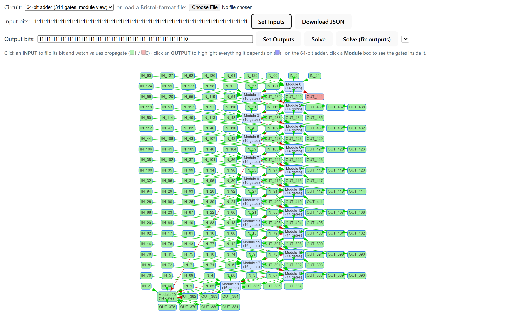
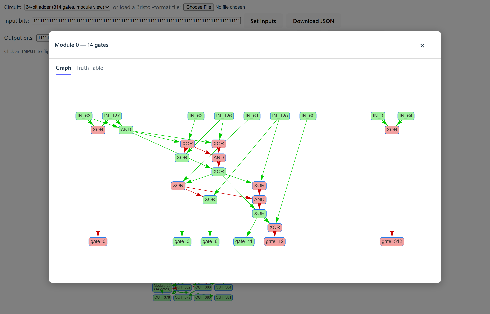

# RAnalysisLogic

An interactive **boolean logic circuit visualizer, simulator and SAT-based
solver** — built toward analyzing SHA-256 as a plain gate circuit.

[](https://github.com/Dimitriuses/RAnalysisLogic/actions/workflows/ci.yml)
[](https://github.com/Dimitriuses/RAnalysisLogic/actions/workflows/deploy-pages.yml)
[](https://www.typescriptlang.org/)
[](https://www.python.org/)
[](https://github.com/Z3Prover/z3)
[](LICENSE)
[](ROADMAP.md)

## ▶ [Try the live demo](https://dimitriuses.github.io/RAnalysisLogic/)

Pick a circuit from the **Circuit** dropdown — the 4-bit adder renders per gate,
the 64-bit adder is deep enough to render as a module overview. Click an
`INPUT` to flip its bit, an `OUTPUT` to highlight everything it depends on, or a
`Module` box to look inside it. The solver buttons need the Python backend, which
isn't running on a static deploy — see [Live demo](#live-demo).

| Circuit graph | `OUTPUT` dependency highlight | Module overview (64-bit adder) |
| --- | --- | --- |
|  |  |  |

<p align="center">
  
  <br><em>Clicking a module opens its real internal gates, coloured from the same live simulation — or its full truth table.</em>
</p>

## What this is

Represent a hash function as a plain boolean circuit (AND/OR/XOR/NOT/NAND/NOR),
then use a SAT solver to ask questions like *"which inputs produce this
output?"* or *"do two different inputs collide?"*. This repo is the tooling
built toward that goal: a circuit loader/visualizer/simulator in the browser,
and a Z3-backed solver behind an HTTP API.

The visualizer and simulator work well on arbitrary circuits. The solver works
on small-to-medium ones. **Collision search itself is not implemented** — the
full SHA-256 circuit (116,246 gates) is far beyond what the current approach
handles, and [`KNOWNISSUES.md`](KNOWNISSUES.md) says exactly where it stops and
why.

### Features

- **Bristol-format parser** that auto-detects both header layouts — Bristol
  Fashion (3 lines) and the older Bristol format (2 lines) used by the
  reference SHA-256 circuit.
- **Interactive graph** (via [vis-network](https://github.com/visjs/vis-network)):
  click an `INPUT` to flip its bit and watch values propagate; click an `OUTPUT`
  to highlight the exact cone of gates and inputs it depends on.
- **Module overview** for deep circuits. A per-gate render of something ~190
  levels deep collapses into an illegible mesh, so circuits past a depth
  threshold render one box per module — with `INPUT`/`OUTPUT` nodes still
  individually visible and interactive. Modules summarize their own state, join
  the dependency highlight, and open a panel showing either their real internal
  gates or their full truth table.
- **Client-side simulation** with no recursion, so circuit depth is bounded by
  memory rather than the JS call stack.
- **Z3 solver** that answers with one satisfying assignment by default, or
  enumerates up to 1000 distinct ones on request.

## Layout

```
logic-sim/     TypeScript + Vite frontend (no framework)
  src/shared/parser.ts   Bristol circuit text -> LogicGraph
  src/logic.ts           simulation, dependency tracing, bit-string I/O
  src/tools.ts           levelling, module grouping, overview/preview building
  src/main.ts            DOM wiring, vis-network rendering and colouring
  tools/                 smoke test + screenshot capture (Playwright)
PyZ3Server/    FastAPI + Z3 backend
  parser.py              LogicCircuit -> Z3 variables and constraints
  solver.py              one model, or up to MAX_MODELS distinct ones
  server.py              POST /solve, POST /truth-table
screenshots/   generated by `npm run screenshots`
```

The central structure is `LogicGraph` — a map of node id to node, where a node's
`inputs` are **other node ids**, not wire numbers. The parser resolves wire
numbers to producer nodes once; everything downstream works in node-id space.
See [`CLAUDE.md`](CLAUDE.md) for the invariants that matter when changing it.

### API

- `POST /solve` — given fixed inputs and/or fixed outputs, returns one
  satisfying model by default, or up to 1000 distinct models with
  `"find_all_solutions": true`.
- `POST /truth-table` — brute-force truth table for a small circuit module.

## Sample circuits

- `logic-sim/src/shared/64-bit-adder.txt` — 314 gates. Loads instantly, deep
  enough to exercise module view, and small enough to solve end-to-end. Bundled
  into the demo.
- `logic-sim/src/shared/sha256.txt` — the actual target: the SHA-256 compression
  function (512-bit input, 256-bit digest, ~116,246 gates). Parses correctly and
  both the module grouping and the simulator handle it in seconds, but it still
  cannot be rendered — see [`KNOWNISSUES.md`](KNOWNISSUES.md#1-sha256txt-cannot-be-rendered).

Both come from the public Bristol circuit collection; provenance and hashes are
in [`NOTICE.md`](NOTICE.md), and [Generating circuit files](#generating-circuit-files)
explains how to get more.

## Live demo

[dimitriuses.github.io/RAnalysisLogic](https://dimitriuses.github.io/RAnalysisLogic/)
— the visualizer and simulator, deployed from `logic-sim` via GitHub Pages
(`.github/workflows/deploy-pages.yml`). It is a **static** build: **Solve**,
**Solve (fix outputs)** and a module's **Truth Table** tab all call PyZ3Server,
which isn't running there, so they show a plain-language disclaimer instead of a
result. Everything else — parsing, simulation, propagation, dependency
highlighting, module overview and the module graph preview — runs entirely in
the browser and works on the hosted demo.

Run the backend locally (below) to use the real Z3 solver.

## Running it

**Frontend**

```bash
cd logic-sim
npm ci
npm run dev
```

Opens on `http://localhost:5173`. Pick a circuit from the dropdown or upload
your own Bristol-format file.

**Backend** — run from the **repository root**, not from inside `PyZ3Server/`.
The server imports `PyZ3Server.*` as a package, so uvicorn must see it on the
path:

```bash
python -m venv .venv
.venv\Scripts\activate          # Windows  (macOS/Linux: source .venv/bin/activate)
pip install -r PyZ3Server/requirements.txt
uvicorn PyZ3Server.server:app --reload
```

Runs on `http://localhost:8000`. CORS is configured for `http://localhost:5173`
only, so use `npm run dev` (not a preview build) when you want the solver.

## Tests

```bash
# Frontend — from logic-sim/
npx tsc --noEmit       # the dev server does NOT typecheck
npm run test           # Vitest unit tests

# End-to-end, against the production build
npm run build
npx vite preview --port 4173 --strictPort &
npm run smoke          # drives a real browser: loads both circuits, toggles
                       # inputs, opens a module preview, asserts no errors

# Backend — from the repository root
pip install -r PyZ3Server/requirements-dev.txt
ruff check PyZ3Server
python -m pytest PyZ3Server
```

CI runs the unit tests and build on **Ubuntu and Windows**, the backend suite on
**Python 3.10 and 3.13**, and the browser smoke test on every push.

## Generating circuit files

Large circuit files don't need to live in git — they're reproducible.

**Source circuits (`*.txt`, Bristol format).** The public Bristol circuit
collection (originally University of Bristol, now maintained by N. Smart's group
at KU Leuven) distributes SHA-256, SHA-512, AES-128 and others in this format:

- <https://homes.esat.kuleuven.be/~nsmart/MPC/>

Download a `.txt` and open it with the file picker. The parser expects:

```
<num_gates> <num_wires>
<num_input_wires> <num_party2_wires> <num_output_wires>
<n_in> <n_out> <in_wire...> <out_wire...> <TYPE>   # one line per gate
```

`<TYPE>` is one of `XOR`, `AND`, `INV`, `OR`, `NAND`, `NOR` (`INV` maps to
`NOT`).

**Parsed graph (`logic-graph*.json`).** The app's own internal representation,
fully regenerable and deliberately not committed: load a circuit and click
**Download JSON**.

## Roadmap and known limitations

- [`ROADMAP.md`](ROADMAP.md) — what's planned, what's researched-but-hard, and a
  detailed log of what's already been fixed.
- [`KNOWNISSUES.md`](KNOWNISSUES.md) — measured, reproducible defects and limits.

The short version: SHA-256 renders nowhere near acceptably (a stack overflow
inside vis-network's own layout code), the solver doesn't scale to 116k gates,
`/truth-table` is unguarded `2^n` brute force, and the backend is a localhost
tool with no auth or TLS. Collision search — the original point — is still
unimplemented.

## Licence and attribution

This project's own source is MIT-licensed — see [`LICENSE`](LICENSE).

The sample circuit files are third-party research artifacts redistributed here
as parser input; their origin, sizes and SHA-256 hashes, along with the licences
of every bundled dependency, are recorded in [`NOTICE.md`](NOTICE.md).
