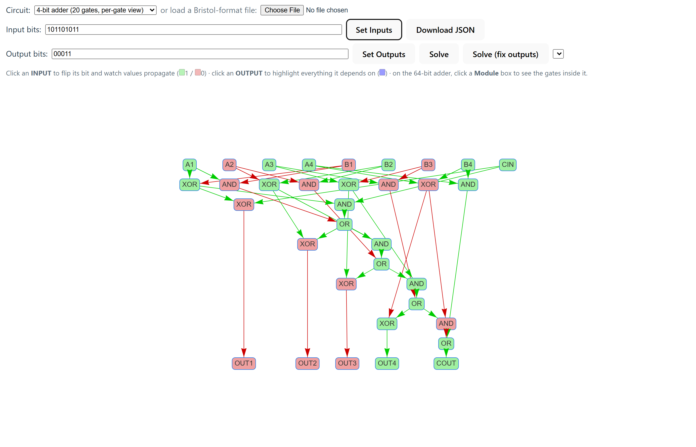
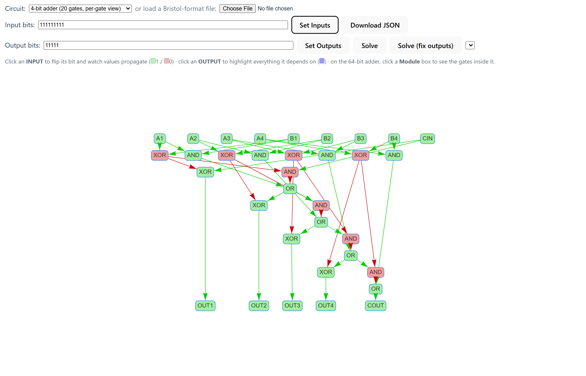
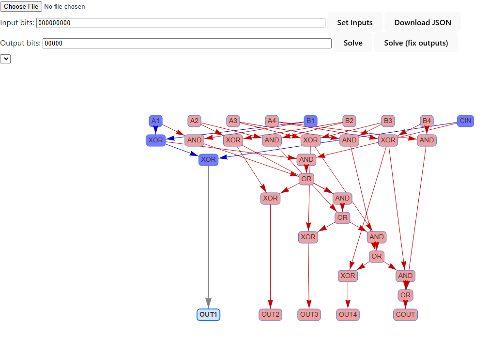

# RAnalysisLogic

[](https://github.com/Dimitriuses/RAnalysisLogic/actions/workflows/ci.yml)

A boolean logic circuit visualizer, simulator, and SAT-based solver, built with the long-term goal of analyzing **SHA-256** as a boolean circuit and exploring a **collision attack** against it.

> **Status: unfinished / experimental.** The circuit visualizer and simulator work well on arbitrary circuits. The SAT-solving backend works on small-to-medium circuits. The original goal — using it to actually find SHA-256 collisions — is not implemented; the full SHA-256 circuit is far too large (116k+ gates) for the current brute-force solving approach to handle.

| Circuit graph | `INPUT` toggle → propagation | `OUTPUT` dependency highlight |
| --- | --- | --- |
|  |  |  |

**[Try the live demo](https://dimitriuses.github.io/RAnalysisLogic/)** (see [Live demo](#live-demo) below for what does/doesn't work there).

## What this is

The idea: represent a hash function as a plain boolean circuit (AND/OR/XOR/NOT/NAND/NOR gates), then use a SAT solver to ask questions like "which inputs produce this output?" or "do two different inputs produce the same output?" (a collision). This repo is the tooling built toward that goal — a circuit loader/visualizer/simulator on the frontend, and a Z3-backed solver on the backend — exercised so far on a 64-bit adder and on a full SHA-256 circuit.

## Structure

- **`logic-sim/`** — TypeScript + Vite frontend.
  - Parses circuit files in the **Bristol circuit format** (a counts line, an `<input-wires> <party-2-wires> <output-wires>` line, then a gate list of `XOR`/`AND`/`INV`/… — the classic format from MPC/garbled-circuit research). See [Generating circuit files](#generating-circuit-files).
  - Renders the circuit as an interactive graph ([vis-network](https://github.com/visjs/vis-network)): click an `INPUT` node to flip its bit and watch values propagate; click an `OUTPUT` node to highlight which inputs it actually depends on.
  - Simulates the circuit fully client-side.
  - Can group the circuit into smaller sub-modules for local truth-table inspection.
  - Sends a circuit to the backend solver with either the inputs or the outputs fixed, to search for satisfying assignments.
- **`PyZ3Server/`** — FastAPI + [Z3](https://github.com/Z3Prover/z3) backend.
  - Converts a circuit into Z3 boolean formulas.
  - `POST /solve` — enumerates up to 1000 satisfying models for a circuit (given fixed inputs or fixed outputs).
  - `POST /truth-table` — brute-force truth table for a small circuit module.

## Sample circuits

- `logic-sim/src/shared/64 Bit Adder.txt` — small, loads instantly, good for exercising the UI and the solver end-to-end.
- `logic-sim/src/shared/sha256.txt` — the actual target: the SHA-256 compression function as a Bristol-format circuit (512-bit input, 256-bit digest out, ~116,246 gates), from the public Bristol circuit collection (see [Generating circuit files](#generating-circuit-files)). Loads and simulates, but is too large to render smoothly or to solve in full with the current solver.

## Live demo

[dimitriuses.github.io/RAnalysisLogic](https://dimitriuses.github.io/RAnalysisLogic/) —
the visualizer/simulator, loaded with the 64-bit adder, deployed via GitHub Pages
(see `.github/workflows/deploy-pages.yml`). It's a static build of `logic-sim`
only: **Solve** / **Solve (fix outputs)** call the PyZ3Server backend, which
isn't running there, so clicking them shows a disclaimer instead of a result.
Run the backend locally (below) to try the real Z3-based solver.

## Running it

**Frontend**
```bash
cd logic-sim
npm install
npm run dev
```
Opens on `http://localhost:5173`. Upload a circuit file with the file picker, or use the hardcoded 4-bit adder that loads by default.

Tests ([Vitest](https://vitest.dev/)): `npm run test` (from `logic-sim/`).

**Backend** — run from the **repository root**, not from inside `PyZ3Server/`. The
server uses package imports (`from PyZ3Server.classes import …`), so uvicorn must
see `PyZ3Server` as a package on the path:
```bash
python -m venv .venv
.venv\Scripts\activate          # Windows  (macOS/Linux: source .venv/bin/activate)
pip install -r PyZ3Server/requirements.txt
uvicorn PyZ3Server.server:app --reload
```
Runs on `http://localhost:8000`. CORS is currently only configured for `http://localhost:5173`.

Tests ([pytest](https://pytest.org/)) and lint ([ruff](https://docs.astral.sh/ruff/),
pyflakes rules only — see `PyZ3Server/pyproject.toml`): from the **repository
root** (same package-path reason as above),
```bash
pip install -r PyZ3Server/requirements-dev.txt
python -m pytest PyZ3Server
ruff check PyZ3Server
```

## Generating circuit files

There are two kinds of circuit file, and neither large one needs to be committed —
both are reproducible from the instructions below.

**1. Source circuits (`*.txt`, Bristol format)** — the inputs the app parses.
`sha256.txt` is taken from the public **Bristol circuit collection** (originally the
University of Bristol; now maintained by N. Smart's group at KU Leuven), which
distributes SHA-256, SHA-512, AES-128 and other functions in exactly this format:

- <https://homes.esat.kuleuven.be/~nsmart/MPC/> — see the older "Bristol format"
  list for the `XOR`/`AND`/`INV` circuits this parser reads.

To analyze a new function, download its `.txt` from that collection (or synthesize
your own to the same layout) and open it with the file picker. The parser expects:

```
<num_gates> <num_wires>
<num_input_wires> <num_party2_wires> <num_output_wires>
<n_in> <n_out> <in_wire...> <out_wire...> <TYPE>   # one line per gate
```

`<TYPE>` is one of `XOR`, `AND`, `INV`, `OR`, `NAND`, `NOR` (`INV` maps to `NOT`).
These files are large and third-party, so prefer **downloading** them over committing
them — keeping only a small in-repo sample like `64 Bit Adder.txt`.

**2. Parsed graph (`logic-graph*.json`)** — the app's own internal representation,
derived from a `.txt`. It is fully regenerable, so it is intentionally not committed.
To (re)create it:

1. Start the frontend (`npm run dev`) and open the app.
2. Load a Bristol-format `.txt` with the file picker.
3. Click **Download** — the app serializes the parsed graph (`{ inputs, outputs, gates }`)
   to JSON and saves it.

## Known limitations

- `/solve` enumerates models by repeatedly asking Z3 for a satisfying assignment and then blocking it, capped at 1000 — it does not scale to a 116k-gate circuit.
- There's no collision-search logic yet (e.g. modeling two circuit instances sharing an output and asking Z3 for differing inputs) — that's the natural next step toward the original goal.
- `/truth-table` is brute-force (`2^n` input combinations) and only practical for small modules.
